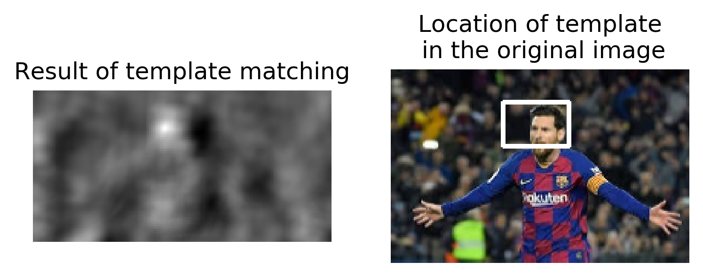
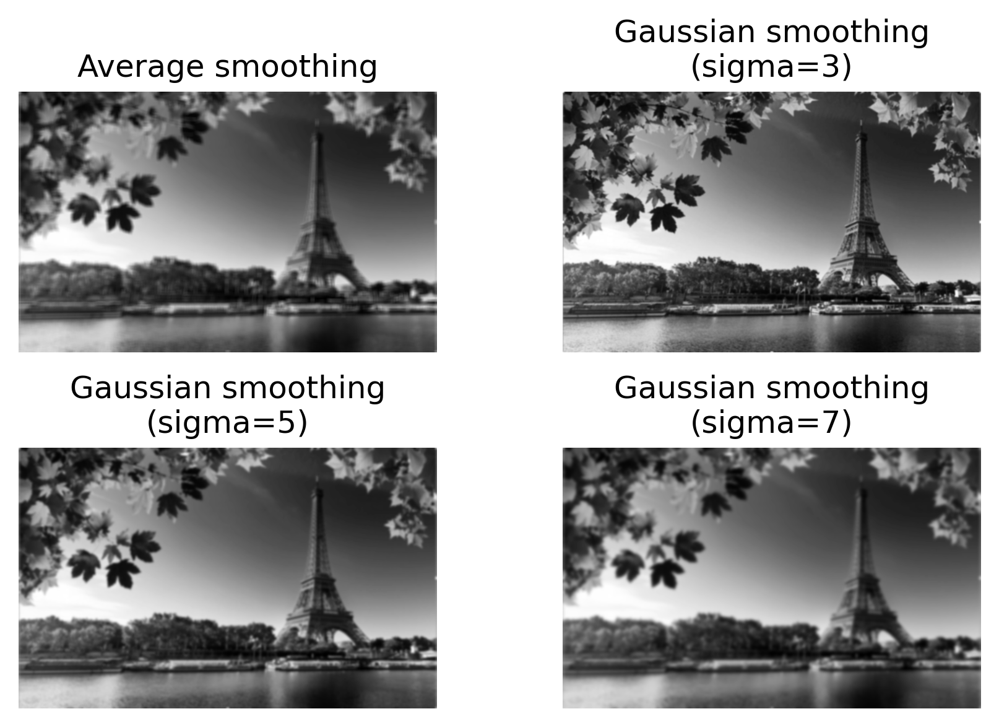
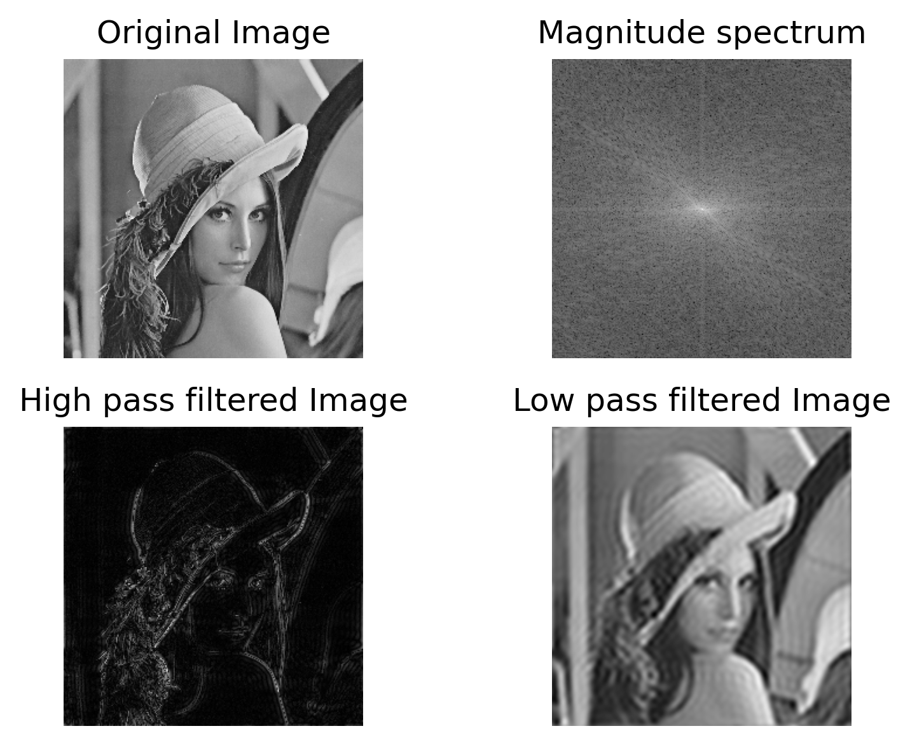
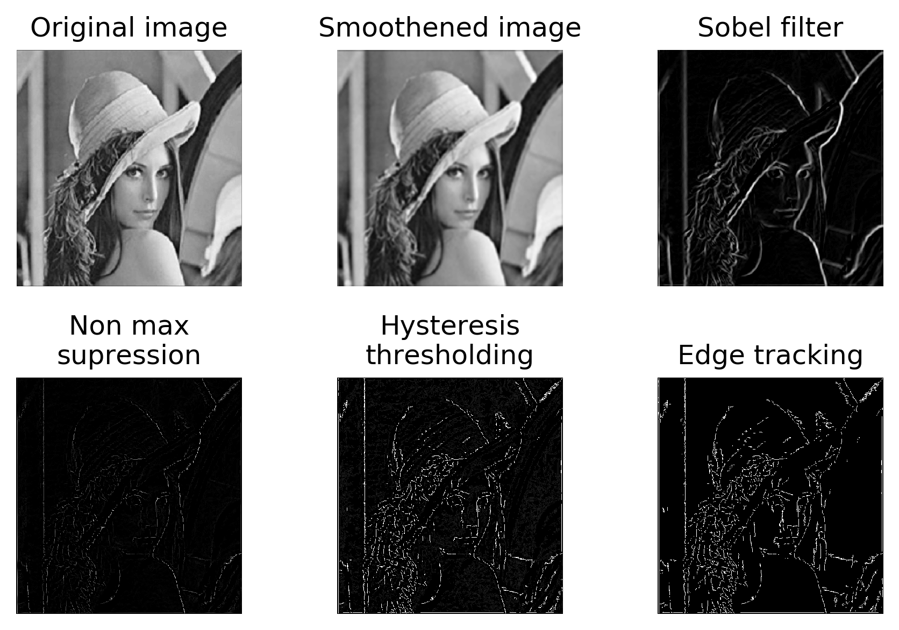
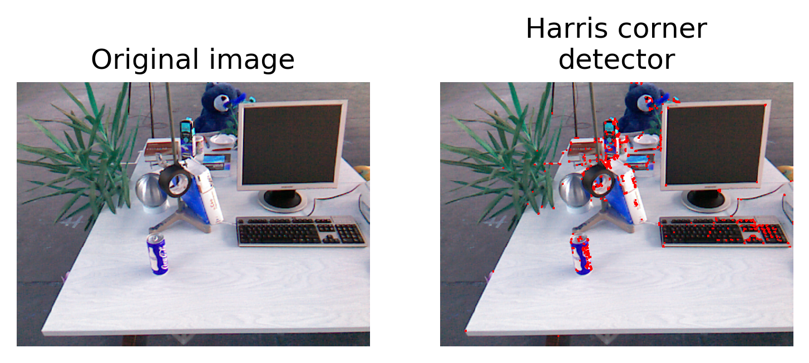
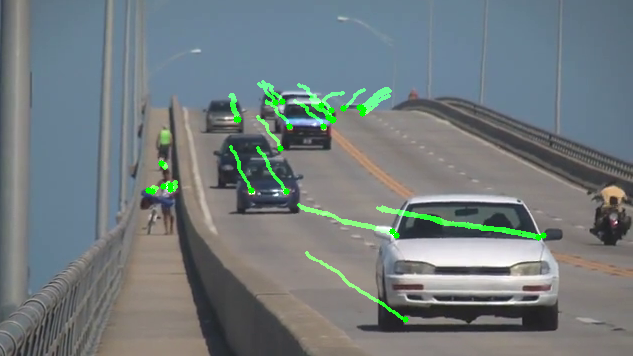

# 2D Image Processing Exercises
This repository contains the solutions to the exercises of the course 2D Image Processing which was programmed in Python using OpenCV library.

### Exercise 1: 

**1. Image correlation and Template matching:**

Template matchning is a method for searching and finding the location of a template image in a larger image. Here cross correlation filtering is performed to calculate the similarity of a template with a image. The code for this can be found in the jupyter notebook "Exercise_1.ipynb" under Problem 1.

|  |
|:--:|
| <b> Figure 1: Template Matching</b>|

**2. Image smoothing and filtering:**

Popular image smoothing filters such as Gaussian and Average smoothing filters are applied over an image and the parameters of the Gaussian smoothing are varied to check the effect on the image. The code for this task can be found in the jupyter notebook "Exercise_1.ipynb" under Problem 2.

|  |
|:--:|
| <b> Figure 2: Gaussian Smoothing</b>|

**3. Image noises and image sharpening:**

Smoothing filters such as Gaussian, Median and Average filters are applied over noisy images. The images are corrupted with salt and pepepr noise, Impulse noise and Gaussian noise. Finally image sharpening filter is applied to sharpen the given image. The code for this task can be found in the jupyter notebook "Exercise_1.ipynb" under Problem 3.

**4. Fourier Transform of images:**

The given image is converted in to frequency domain to analyse the magnitude spectrum of the image. High and low pass filters are applied for the image in the frequency domain to understand what features of the image were retained/lost. The code for this task can be found in the jupyter notebook "Exercise_1.ipynb" under Problem 4.

|  |
|:--:|
| <b> Figure 3: Image in the frequency domain</b>|

### Exercise 2: Edge and Corner detection:

For the given image, Canny edge detection is applied in two ways, first using the standard function from OpenCV and the developing Canny edge detector from scratch. Harris corner detector is applied for the image to detect interest points. Finally SIFT feature detector is applied to create feature descriptors and to match the features between the two images. The code for this task can be found in the jupyter notebook "Exercise_2.ipynb".

|  |
|:--:|
| <b> Figure 4: Step-by-step implementation of Canny Edge Detector</b>|

|  |
|:--:|
| <b> Figure 5: Harris Corner detector</b>|

### Exercise 3: Object tracking and Optical flow

For the given video, Lucas-Kanade optical flow method is applied to track the feature points through the video. Coarse-to-fine iterative refinement is also applied to deal with larger movements in the video. The code for this task can be found in the jupyter notebook "Exercise_3.ipynb". 

|  |
|:--:|
| <b> Figure 6: Lucas-Kanade Optical Flow</b>|